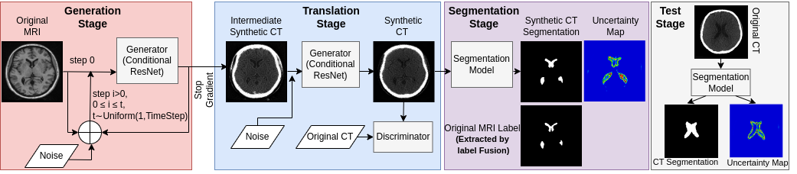

# Deep learning-based brain ventricle segmentation in Computed Tomography using domain adaptation
## Project Overview
Efficient and accurate brain ventricle segmentation from clinical CT scans is critical for emergency surgeries like ventriculostomy. Our project introduces a novel uncertainty-aware ventricle segmentation technique that leverages diffusion-model-based domain adaptation without the need for CT segmentation ground truths. This method employs the diffusion Schrödinger Bridge and an attention recurrent residual U-Net to utilize unpaired CT and MRI scans for automatic CT segmentation, demonstrating significant improvement over traditional methods. For detailed insights, you can read our paper: [CT-based brain ventricle segmentation via
diffusion Schr¨odinger Bridge without target domain ground truths](https://arxiv.org/pdf/2405.18267)

## Challenges
CT scans lack well-annotated public databases, unlike MRI scans. This makes it difficult to develop robust brain segmentation algorithms. Additionally, CT scans suffer from poor soft tissue contrast, which complicates accurate brain ventricle segmentation. These limitations hinder the development of reliable deep learning models for clinical use, leading to suboptimal outcomes in critical medical procedures like ventriculostomy.

## Solution
To address these challenges, we developed an innovative end-to-end deep learning technique that employs a diffusion model for MRI-to-CT domain adaptation without the need for CT segmentation ground truths. Our method leverages the more accessible MRI ground truth labels to synthesize accurate segmentation in unpaired CT scans. By employing the diffusion Schrödinger Bridge for high-fidelity unpaired MRI vs. CT translation and an attention recurrent residual U-Net for segmentation, we achieve improved accuracy and provide intuitive uncertainty measures for quality control. This joint learning framework of image translation and segmentation tasks offers significant benefits over traditional training approaches and GAN-based techniques.

## Translation Models
* Cycle-Consistent Adversarial Networks (CycleGAN): [CycleGAN GitHub](https://github.com/junyanz/pytorch-CycleGAN-and-pix2pix/tree/master)
* Contrastive Learning for Unpaired Image-to-Image Translation (CUT): [CUT GitHub](https://github.com/taesungp/contrastive-unpaired-translation)
* Unpaired Neural Schrödinger Bridge (UNSB): [UNSB GitHub](https://github.com/cyclomon/UNSB/tree/main)
## Segmentation Models
Our segmentation phase employed an attention-based residual recurrent U-Net architecture, compared with traditional U-Net and ResNet. For more information on the base segmentation model, see [R2AU-Net](https://www.hindawi.com/journals/scn/2021/6625688/).
## UNSB_Seg Model Weights
The weights for the UNSB model with segmentation are available [here](https://drive.google.com/drive/folders/1AI3iAaEm2BJDfF5jDSelfV-pcvVhYhK9?usp=sharing).
To use these weights, download them and place them in the `./checkpoints/UNSB_Seg` folder.

## Confidence Measures
We incorporated Monte Carlo dropouts in both MRI-to-CT translation and CT segmentation phases to provide an intuitive interpretation of the segmentation results.
## Inspiration
Our model's design is inspired by [SynSeg-Net](https://github.com/MASILab/SynSeg-Net), aimed at synthesizing and segmenting anatomical structures in medical imaging. Details on this inspiration can be found here: SynSeg-Net GitHub.

## Datasets
* OASIS3: 200 CT scans
* NeuroMorphometrics: 68 MRIs from OASIS and ADNI3 with manual labels
* IXI: 63 MRIs
* In-house dataset: 67 CT scans
* CERMEPiDB-MRXFDG (iDB): 27 paired MRI and CT sets (Test)
## Silver Ground Truths for iDB and IXI Datasets:
Generated using multi-atlas label fusion and majority voting with the entire NeuroMorphometrics dataset as the atlas library with [ANTs Joint Label Fusion Method](https://github.com/ANTsX/ANTs/blob/master/Scripts/antsJointLabelFusion.sh)

## Conclusion
We developed a novel, uncertainty-aware, diffusion-based CT brain ventricle segmentation method that does not require expert labels in the target image modality. By utilizing the diffusion Schrödinger Bridge and combining joint image translation and segmentation training, our approach outperformed other methods in comprehensive comparisons.

Acknowledgment:
We acknowledge the support of the New Frontiers in Research Fund (NFRF) under fund number NFRFE-2020-00241.

## Guide for Running Code
### Training
1. **Set options:**
   - Configure settings in `options/base_options.py`.
2. **Run training:**
   - Execute `run_models.sh`.
### Testing
1. **Run tests:**
   - Execute `run_test.sh`.
2. **Set options for different models:**
   - **UNSB:** `sb_test.py`
   - **CUT:** `cut_test.py`
   - **CycleGAN:** `CycleGAN_test.py`
### Data Preparation

#### Downloading Data
- **OASIS Data:**
  - Run `download_oasis_scans.sh` in `data_preprocessing`.

#### Preprocessing

- **MRI Data (without CT and label pairs):**
  - Run `run_mri_preprocess.sh`.

- **CT Scans (without MRI pairs):**
  - Run `run_ct_preprocess.sh`.

- **CT and MRI Pairs:**
  - Run `run_CT2MR_registration.sh`.

- **MRI with Labels:**
  - Run `run_MRI_Labels_preprocess.sh`.
### Label Creation

#### Label Fusion Method
1. **Brain Extraction:**
   - Extract brain in MRIs in atlas and target images using `run_beast.sh`.
2. **Label Fusion:**
   - Use extracted MRIs to run`labelFusion_neuroglia.sh`.

#### Extracting Ventricle Labels
- **Extract Ventricle from Whole Brain Label:**
  - Run `run_extract_labels.sh`.

